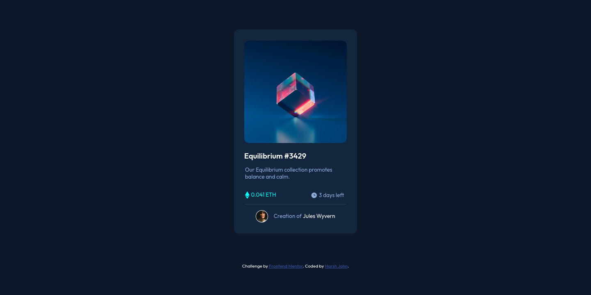
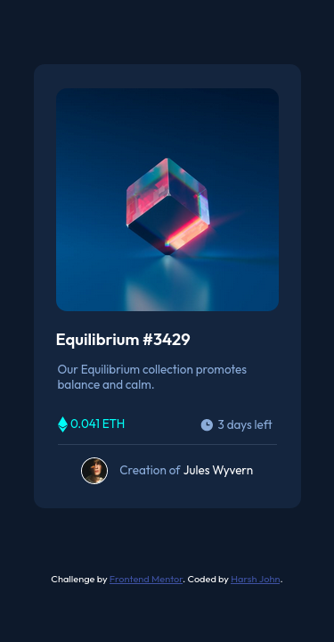

# Frontend Mentor - NFT preview card component solution

This is a solution to the [NFT preview card component challenge on Frontend Mentor](https://www.frontendmentor.io/challenges/nft-preview-card-component-SbdUL_w0U). 

## Table of contents

- [Overview](#overview)
  - [The challenge](#the-challenge)
  - [Screenshot](#screenshot)
  - [Links](#links)
- [My process](#my-process)
  - [Built with](#built-with)
  - [What I learned](#what-i-learned)
  - [Continued development](#continued-development)
- [Author](#author)

## Overview

### The challenge

Users should be able to:

- View the optimal layout depending on their device's screen size
- See hover states for interactive elements

### Screenshot

#### 1440px

#### 375px

### Links

- Solution URL: [Solution](https://github.com/HarshJohn/-NFT-preview-card.git)
- Live Site URL: [Website](https://ntfpreviewcardchallenge-harshjohn.netlify.app/)

## My process

### Built with

- Semantic HTML5 markup
- CSS custom properties
- Flexbox
- Mobile-first workflow

### What I learned

I was able to utilize my skills of Flexbox to some extant.
Ofc these challenges are not tough, therefore I am not really learning something new. But, at least I am able to know that I can make these pages.

### Continued development

I will start learning JavaScript and will soon try some more complicated challenges which can help me upgrade my skills.

## Author

- Website - [Harsh John](https://harshjohn.github.io/)
- Frontend Mentor - [@HarshJohn](https://www.frontendmentor.io/profile/HarshJohn)
- Twitter - [@harshj_ohn](https://twitter.com/harshj_ohn)
